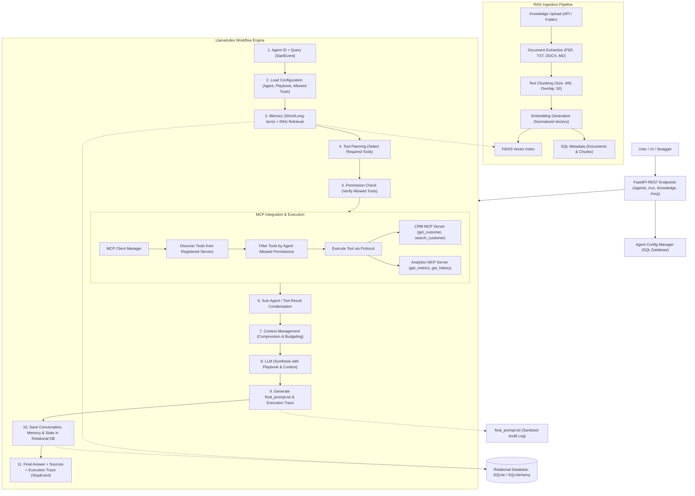

# Orchestrated Multi-MCP AI Agent Platform

An enterprise AI agent platform that coordinates multiple Model Context Protocol (MCP) servers, executes tools from different servers in the same workflow, loads dynamic database-driven agent playbooks, retrieves custom domain knowledge via FAISS RAG, manages short-term and long-term memory, and provides complete execution observability and sanitized prompt logging.

Built with **FastAPI**, **LlamaIndex Workflows**, **Model Context Protocol (MCP)**, **FAISS Vector Search**, and **SQLAlchemy/SQLite**.

---

## Architecture Overview



---

## Detailed Execution Flow (Step-by-Step)

The end-to-end execution adheres strictly to the required flow:
1. **Agent ID + Query**: Sent via `POST /agents/{agent_id}/run` with optional `conversation_id`.
2. **Load Configuration**: The system fetches agent metadata, playbook, model parameters, and allowed tool permissions (`allowed_tools`) from the SQL database.
3. **Memory + RAG**:
   - Short-term sliding window messages are retrieved from the `messages` table.
   - Long-term semantic facts (e.g., customer communication preferences) are retrieved from the `memories` table.
   - RAG knowledge is retrieved from the FAISS vector index filtered exclusively by the agent's assigned `knowledge_base`.
4. **Tool Planning**: The planner assesses the user query, available tools, and knowledge context to determine needed MCP tool calls across CRM and Analytics servers.
5. **Permission Check**: Each planned tool call is validated against the agent's `allowed_tools` whitelist. Unauthorized calls are rejected before execution.
6. **CRM MCP + Analytics MCP**: Authorized calls are dispatched through the MCP Client Manager to the target MCP servers (demonstrating multi-server tool coordination in a single workflow).
7. **Context Management & Sub-Agent**: Ephemeral sub-agent condenses large tool results; context compression keeps token usage within LLM budget.
8. **LLM Synthesis**: The LLM synthesizes the final response following the agent's system prompt and playbook rules.
9. **Final Answer + Sources + Execution Trace**: The result is packaged with document citations, a step-by-step execution trace is saved to the database, and `final_prompt.txt` is logged to disk.

---

## Key Technical Implementations

### 1. Agent Management & Dynamic Playbooks
* Agents are stored in the SQL database (`agents` and `agent_tools` tables) and loaded dynamically at runtime.
* Prompts, playbooks, temperatures, and models can be modified via `PUT /agents/{agent_id}/config` without code changes or server restarts.
* The database schema enables versioning, auditing, and multi-tenant isolation.

### 2. Multi-MCP Server Tool Orchestration
* **CRM MCP Server**:
  - `CRM.get_customer(customer_id)`: Fetches enterprise customer profile, contract terms, stakeholders, and SLA tier.
  - `CRM.search_customer(query)`: Directory search across accounts.
  - `CRM.update_notes(customer_id, note)`: Appends operational notes.
* **Analytics MCP Server**:
  - `Analytics.get_customer_metrics(customer_id)`: ARR, MRR, churn risk score, NPS score, active users, ticket resolution time.
  - `Analytics.get_customer_history(customer_id, months)`: Recent operational timeline, QBRs, capacity upgrades, and incident history.
* **Dynamic Discovery**: `MCPClientManager.discover_tools()` queries all connected servers.
* **Agent-Level Permission Whitelist**: Tools are strictly filtered against the agent's `allowed_tools` list before being made available or executed.

### 3. Workflow Orchestration with LlamaIndex Workflows
* Uses `llama_index.core.workflow` with typed events (`AgentLoadedEvent`, `MemoryAndRAGLoadedEvent`, `ToolPlanGeneratedEvent`, `ToolsExecutedEvent`, `ContextCondensedEvent`).
* **Why Orchestration?** Decouples step execution, manages independent state passing, enforces timeout guarantees, captures per-step metrics, and prevents infinite tool-calling loops by bounding iterations (`max_iterations`).
* **Error Resilience**: If an individual MCP tool encounters an error or timeout, the error is captured in the trace and the workflow proceeds gracefully without crashing.

### 4. FAISS Vector Search & RAG Ingestion Pipeline
* **Ingestion Pipeline**: Scans files (`.md`, `.txt`, `.pdf`, `.docx`), extracts text, chunks into 400-token blocks with 50-token overlap, and computes 384-dimensional normalized embedding vectors.
* **FAISS Vector Store**: Uses `IndexFlatIP` (inner product with normalized vectors = exact cosine similarity).
* **Metadata Lineage**:
  $$\text{FAISS Vector ID} \longrightarrow \text{Document Chunk} \longrightarrow \text{Document} \longrightarrow \text{Knowledge Base}$$
* **Knowledge Isolation**: An agent configured with `knowledge_base: "customer_docs"` will only retrieve chunks belonging to that knowledge base, preventing cross-domain data leakage.

### 5. Dual Memory & Context Management
* **Short-Term Memory**: Stores recent user/assistant turns in the `messages` table for a specific `conversation_id`. Uses a sliding window (`limit=6`) to avoid saturating LLM context.
* **Long-Term Memory**: Stores persistent facts and customer preferences (e.g. communication channels, billing frequency) in the `memories` table. Filtered semantically against query terms to only load relevant facts.
* **Context Compression**: Ephemeral `TemporaryResearchSubAgent` condenses raw JSON outputs from CRM and Analytics into a dense factual synthesis, reducing prompt token consumption by over 60%.

### 6. Observability & Prompt Audit Logging
* **Execution Trace**: Real-time structured timeline saved in `execution_steps` table recording step number, tool name, input arguments, output payload, status, and duration in milliseconds.
* **Audit File (`final_prompt.txt`)**: For every execution, writes `logs/executions/{execution_id}_prompt.txt` containing the system prompt, playbook, query, memory turns, retrieved RAG snippets, and tool findings.
* **Security & Secret Redaction**: All API keys, bearer tokens, and sensitive credentials are scrubbed using regex patterns before being logged.

---

## Relational Database Schema (SQL)

| Table | Primary Key | Foreign Keys / Relationships | Purpose |
|---|---|---|---|
| `agents` | `agent_id` (PK) | 1-to-many with `agent_tools`, `executions` | Agent definitions, playbooks, model settings, and memory/workflow JSON configurations |
| `agent_tools` | `id` (PK) | `agent_id` $\rightarrow$ `agents.agent_id` | Whitelist of allowed tools per agent |
| `mcp_servers` | `server_id` (PK) | - | Registered MCP servers, transport type, and endpoint metadata |
| `knowledge_bases`| `kb_id` (PK) | 1-to-many with `documents`, `document_chunks` | Knowledge base partitions and chunking configurations |
| `documents` | `id` (PK) | `kb_id` $\rightarrow$ `knowledge_bases.kb_id` | Ingested source files, hashes, file types, and sizes |
| `document_chunks`| `id` (PK) | `document_id`, `kb_id`, `vector_id` (indexed) | Text chunks, token counts, and FAISS vector mappings |
| `conversations` | `conversation_id` (PK) | 1-to-many with `messages` | Dialogue sessions tied to agents |
| `messages` | `id` (PK) | `conversation_id` $\rightarrow$ `conversations` | Conversational dialogue turns (role, content, token count) |
| `memories` | `id` (PK) | `entity_key` (indexed), `conversation_id` | Semantic facts, customer preferences, and importance weights |
| `executions` | `execution_id` (PK) | `agent_id` $\rightarrow$ `agents.agent_id` | Top-level execution runs, queries, answers, status, and total duration |
| `execution_steps`| `id` (PK) | `execution_id` $\rightarrow$ `executions.execution_id` | Granular step timing, tool inputs, results, and error logs |

---

## How It Works & How to Run

### Prerequisites
* Python 3.10+ (tested on Python 3.12)
* Windows, macOS, or Linux

### Installation

1. **Clone or navigate to the project directory**:
   ```bash
   cd c:/Users/AmanThakur/Desktop/finalProject
   ```

2. **Install dependencies**:
   ```bash
   pip install -r requirements.txt
   ```

3. **Configure Environment (Optional)**:
   Copy `.env.example` to `.env`:
   ```bash
   cp .env.example .env
   ```
   > **Note**: An external `OPENAI_API_KEY` is completely optional. If no API key is set, the platform automatically runs using its built-in deterministic, rule-based reasoning engine, ensuring full offline functionality and reliable test pass rates.

4. **Initialize Database & Ingest Sample Data**:
   ```bash
   python -m app.seed_data
   ```
   This command automatically:
   - Creates all SQLite tables
   - Seeds the 3 sample agents (`customer_research_agent`, `financial_analyst_agent`, `support_compliance_agent`)
   - Registers CRM and Analytics MCP servers
   - Ingests Markdown documentation from `knowledge/` into FAISS vector index
   - Populates initial long-term memories for Customer ABC

---

## Running the Application

### 1. Start the FastAPI Server
```bash
uvicorn app.main:app --host 0.0.0.0 --port 8000 --reload
```

The server starts at `http://localhost:8000`.

### 2. Access the Interactive Web Dashboard
Open your browser and navigate to:
```text
http://localhost:8000/
```
The Web Dashboard features:
* **Agent Selector**: Switch between configured agents and inspect their allowed tools, model, and active knowledge base in real time.
* **Preset Queries**: Quick-fill queries for customer ABC research, analytics metrics, and long-term memory checks.
* **Final Answer Tab**: Formatted markdown response summarizing CRM, Analytics, and Knowledge Base findings.
* **Execution Trace Tab**: Visual step-by-step timeline displaying execution duration for each step and tool call.
* **Sources & RAG Tab**: Retrieved document chunks with similarity scores.
* **Prompt Audit Tab**: Inspect the generated `final_prompt.txt` with sensitive information redacted.
* **MCP Catalog Tab**: Inspect connected MCP servers and dynamically discovered tools.
* **Knowledge Ingestion Form**: Upload new documents to test live vector chunking.

### 3. Access Swagger / OpenAPI Documentation
Open:
```text
http://localhost:8000/docs
```
Interactive API testing with complete JSON schemas for all endpoints.

---

## Running the Automated Test Suite

Run the full pytest suite with verbose output:
```bash
python -m pytest -v
```

### Test Coverage Summary:
* `tests/test_mcp_execution.py`: Tests tool discovery, multi-server execution across CRM and Analytics, and agent permission guard enforcement.
* `tests/test_rag_retrieval.py`: Tests chunking, embedding generation, FAISS vector search, and knowledge base partition boundaries.
* `tests/test_workflow_run.py`: Tests end-to-end LlamaIndex workflow execution, database trace records, and `final_prompt.txt` file generation.
* `tests/test_api_endpoints.py`: Tests all REST endpoints (`/health`, `/agents`, `/run`, `/executions`, `/mcp`, `/knowledge`).

---

## Example REST API Requests

### 1. Run Agent Query
```bash
curl -X POST "http://localhost:8000/agents/customer_research_agent/run" \
  -H "Content-Type: application/json" \
  -d '{
    "query": "Give me a complete summary of customer ABC including recent activity and internal documentation.",
    "conversation_id": "conv_demo_01"
  }'
```

### 2. Retrieve Execution Trace
```bash
curl -X GET "http://localhost:8000/executions/{execution_id}/trace"
```

### 3. Retrieve Auditable Prompt
```bash
curl -X GET "http://localhost:8000/executions/{execution_id}/prompt"
```

### 4. Dynamically Update Agent Configuration
```bash
curl -X PUT "http://localhost:8000/agents/customer_research_agent/config" \
  -H "Content-Type: application/json" \
  -d '{
    "temperature": 0.3,
    "allowed_tools": ["CRM.get_customer", "Analytics.get_customer_metrics"]
  }'
```
